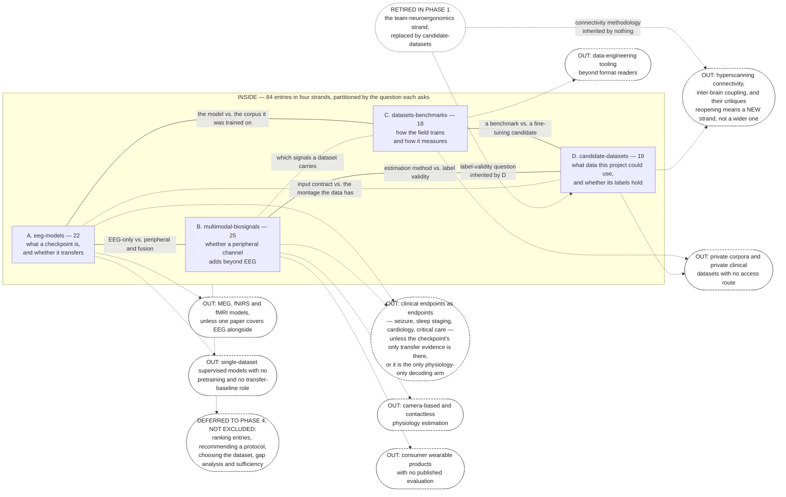

# Scope diagram: where the boundary of this corpus runs

Phase 3 synthesis, and the last of the five documents in this directory. Its inputs are the four
strand briefs — chiefly their **Out of scope** sections, which are the record of what was excluded
and why — together with the four ontologies, [science-map](./science-map.md), the four strand
`INDEX.md` search records, and the coverage warnings emitted by `tools/validate_corpus.py`.

**What this document is for.** Phase 4 will name gaps. Every gap it names has two possible
explanations and they are not close to equivalent: *the literature does not contain this*, or *we
chose not to collect it*. Nothing else in the corpus distinguishes them. The ontologies describe
what is inside a strand; the science map describes what crosses strands; neither says what was
never looked for. This document is where that is written down, so that a Phase 4 statement of
absence, and any statement of absence that reaches the eventual direction paper, can be checked
against whether anyone looked.

**What this document is not.** It does not assess whether an exclusion was correct, does not
recommend reopening anything, and does not estimate what an exclusion cost the project. Those are
Phase 4's, using this as input. Where an exclusion appears not to have been honoured, that is
recorded as a defect in the record (§7) rather than as a judgment about the scope decision.

---

## 1. The four strands and how they partition the topic

The corpus holds **84 entries in four strands**: `eeg-models` (22), `datasets-benchmarks` (18),
`multimodal-biosignals` (25), `candidate-datasets` (19). The partition is by *question asked*, not
by object studied, and the briefs state each dividing line explicitly because the same object
frequently answers two questions.

| strand | brief | the question it owns |
|---|---|---|
| A. `eeg-models` | [strand-eeg-models](../../_briefs/strand-eeg-models.md) | what a pretrained EEG checkpoint is, what it was made from, and whether it transfers |
| B. `multimodal-biosignals` | [strand-multimodal-biosignals](../../_briefs/strand-multimodal-biosignals.md) | whether a peripheral channel adds decodable information beyond EEG |
| C. `datasets-benchmarks` | [strand-datasets-benchmarks](../../_briefs/strand-datasets-benchmarks.md) | how the field trains and measures, and whether the measurement can be trusted |
| D. `candidate-datasets` | [strand-candidate-datasets](../../_briefs/strand-candidate-datasets.md) | what data this project could fine-tune or evaluate on, and whether its labels hold |

The dividing lines, quoted from the briefs that state them:

- **A / C.** "This strand cards the corpus; strand A cards the model trained on it."
- **C / D.** "Strand C cards a dataset when it is what a model was pretrained on or benchmarked
  against; this strand cards it when the project could fine-tune on it. A dataset that is both gets
  carded in both, with each card written to its own strand's question."
- **A / B.** EEG-only pretraining and architecture work is A's; peripheral encoders and fusion are
  B's.
- **B / D.** "The `candidate-datasets` strand covers label validity; this strand covers the
  estimation method."

Double-carding is therefore a designed feature of the partition, not a duplication defect. Four
identifiers are carded in two strands each — EEG-BIDS, Sleep-EDF, OpenNeuro and AdaBrain-Bench —
and the validator warns on each so the pairing stays visible. Phase 5 must merge them to one
bibliography entry per identifier.

### 1.1 The partition changed during Phase 1, and that is the largest exclusion in the review

An earlier partition had a **`team-neuroergonomics` strand**. It was replaced by
`candidate-datasets`. The out-of-scope section of
[strand-candidate-datasets](../../_briefs/strand-candidate-datasets.md) records both the
replacement and what went out with it:

> Hyperscanning connectivity measures, inter-brain coupling, and their critiques, except where a
> paper bears directly on label validity. This strand replaced an earlier team-neuroergonomics
> strand, and that methodological literature went out of scope with it. If Phase 3 finds the
> omission load-bearing, reopen it as a new strand rather than smuggling it in here.

Three consequences a later reader must hold together:

1. **This is the single largest deliberate exclusion in the review.** The project's research
   question is framed around a dyadic / team neuroergonomics setting, and the entire methodological
   literature on how two simultaneously recorded brains are analysed together sits outside the
   corpus by decision.
2. **The label-validity question survived the retirement and the connectivity question did not.**
   Category 3 of the candidate strand "inherits the question that the retired team-neuroergonomics
   strand owned". Nothing inherited the connectivity methodology.
3. **The reopening rule is a partition change, not a widening.** The brief's instruction is
   explicit: reopen it as a new strand rather than widening `candidate-datasets`. Any Phase 4
   proposal to admit this material is therefore a proposal to change the partition.

What was excluded is the *methodology*, not the *data*. Multi-person recordings remained in scope
and are category 1 of the candidate strand; four entries sit there
([candidate-datasets/INDEX](../collection/candidate-datasets/INDEX.md) §1). The exclusion is
visible in that strand's own search record: the hyperscanning query returned 20 results of which
zero were dataset releases, and the returns — Hamilton 2020, Barraza et al. 2019, Hakim et al. 2023
on inter-brain coupling quantification, Zamm et al. 2024, Carollo & Esposito 2024 — are recorded as
"most of which are out of scope for this strand under the brief's exclusion of hyperscanning
connectivity methodology". So the exclusion was encountered in practice and honoured, and the
specific works it turned away are named.

### 1.2 The diagram

Reading it: the yellow box is the corpus. Solid lines inside it are the four dividing lines the
briefs state; dotted lines inside it are two crossings that exist between strands but are not
partition boundaries. Every rounded `OUT:` node is an exclusion recorded in a brief, and the dashed
arrow into it runs from the strand whose brief records it — where two strands record the same
exclusion, both arrows are drawn. The retired `team-neuroergonomics` strand is shown with what each
half of it became: the label-validity question was inherited by strand D, the connectivity
methodology by nothing. The rounded node at the bottom right holds what is deferred to Phase 4,
which is not the same as excluded.

---

## 2. Deliberate exclusions: the register

Every exclusion recorded in a brief, with its rationale and its kind. Four kinds are distinguished
because they have different implications for Phase 4:

- **partition** — the material *is* in the corpus, in a sibling strand. Not an exclusion at all,
  and a Phase 4 gap claim here is almost certainly a filing error.
- **scope judgment** — a decision about what the review is about.
- **resource limit** — a cap on volume or effort, or an obtainability constraint.
- **phase boundary** — deferred, not excluded.

### 2.1 Strand A, `eeg-models`

| excluded | rationale as recorded | kind |
|---|---|---|
| Clinical seizure detection and sleep staging *as applications* | in scope only "where a checkpoint's only published transfer evidence is on those tasks" — the checkpoint is the object, the clinical claim is not | scope judgment, with a stated exception |
| Magnetoencephalography, fNIRS and fMRI models | "except where a single paper covers EEG alongside them" | scope judgment, with a stated exception |
| Peripheral physiology models and fusion architectures | "Those belong to the `multimodal-biosignals` strand" | partition |
| Dataset characterization beyond one line naming the pretraining corpus | "Datasets are the `datasets-benchmarks` strand" | partition |
| Comparing or ranking entries against each other | "Collection only" | phase boundary |
| Single-dataset supervised models with no pretraining and no role as a transfer baseline | inclusion rule is that the work pretrains, evaluates a pretrained model, or critiques that practice | scope judgment |
| BCI application papers using a pretrained model as a black box with no baseline comparison | a card without a baseline number "is not useful to Phase 3" | scope judgment |
| Further signal-structure or theoretical-motivation papers beyond two | the theoretical-motivation line is capped at 2 entries "by a deliberate scoping decision to keep this thread small"; the brief states the line is at its cap and cannot be extended "without reopening the scoping decision, which is a Phase 3 conversation" | resource limit, recorded as a scoping decision |

The cap is at its limit and both cards say so:
[muller-2024-transformers-cortical-waves](../collection/eeg-models/muller-2024-transformers-cortical-waves/card.md)
and
[alexander-2019-cortical-waves](../collection/eeg-models/alexander-2019-cortical-waves/card.md).
The second is also the one entry in the strand that falls outside the strand's own inclusion
criterion, admitted by an explicit scoping decision recorded in the brief and repeated on the card
(see [eeg-models-ontology](./eeg-models-ontology.md) §5.1).

### 2.2 Strand B, `multimodal-biosignals`

| excluded | rationale as recorded | kind |
|---|---|---|
| EEG-only pretraining and architecture work | "That is the `eeg-models` strand" | partition |
| Dataset characterization beyond naming which signals a dataset carries | "That is the `datasets-benchmarks` strand" | partition |
| Cardiology, sleep medicine and critical-care prediction as clinical endpoints | two stated exceptions: the paper is the primary reference for a peripheral foundation model, or "the clinical setting is the only one in which a physiology-only decoding arm is reported". In the second case, "card the decoding evidence and leave the clinical claim alone" | scope judgment, amended in the brief itself |
| Camera-based or contactless physiology estimation | stated flatly, with no exception at the time of collection | scope judgment — **see §7.1** |
| Consumer wearable stress or recovery products with no published evaluation | an evidential standard rather than a topical one | scope judgment |
| Medical diagnosis from ECG alone with no representation-learning or transfer angle | inclusion requires modelling at scale, fusion, an ablation, or an engineered-feature baseline | scope judgment |
| Comparing or ranking entries against each other | "Collection only" | phase boundary |

The clinical-endpoint exclusion was amended *inside the brief* for
[wang-2025-sedation-non-eeg](../collection/multimodal-biosignals/wang-2025-sedation-non-eeg/card.md),
on the stated ground that "a clinical setting is where physiology-only decoding is most often
reported and the endpoint is incidental to what the card contributes". This is the corpus's clearest
case of an exclusion consciously overridden rather than quietly crossed, and the override is
narrow: the decoding evidence is carded, the clinical claim is not.

### 2.3 Strand C, `datasets-benchmarks`

| excluded | rationale as recorded | kind |
|---|---|---|
| Model architectures and pretraining objectives | "This strand cards the corpus; strand A cards the model trained on it" | partition |
| Fusion methods and peripheral signal modeling | "That is strand B" | partition |
| Candidate datasets to fine-tune on, dyadic and multi-person recordings, EEG-plus-peripheral datasets, and label validity | "Those moved to strand D" — this is the other half of the Phase 1 repartition | partition |
| Data engineering tooling beyond format readers | keeps category 5 to formats and their readers | scope judgment |
| Recommending an evaluation protocol for this project | "Phase 4 decides that from this evidence" | phase boundary |
| Private corpora with no access route | not obtainable, so not specifiable | resource limit |

The strand records how close the C/D line ran in one case: Sleep-EDF "was the only close call, since
it carries EOG, EMG and respiration and could read as a peripheral-physiology candidate". It is
carded on both sides, and the two cards read the same channels oppositely and correctly — "present,
standardized, and universally discarded" in
[sleep-edf-expanded](../collection/datasets-benchmarks/sleep-edf-expanded/card.md) against "usable
as signal by construction" in [sleep-edfx](../collection/candidate-datasets/sleep-edfx/card.md).
That pair is the partition working, not failing.

### 2.4 Strand D, `candidate-datasets`

| excluded | rationale as recorded | kind |
|---|---|---|
| Architectures, pretraining objectives and checkpoints | "That is strand A" | partition |
| Fusion methods and peripheral signal modeling | "That is strand B" | partition |
| Large pretraining corpora, benchmark protocols and split conventions | "That is strand C" | partition |
| **Hyperscanning connectivity measures, inter-brain coupling, and their critiques** | "except where a paper bears directly on label validity"; went out with the retired `team-neuroergonomics` strand; reopening requires a new strand | **scope judgment — §1.1** |
| Deciding which dataset the project should use | "Phase 4 decides that from this inventory" | phase boundary |
| Private clinical datasets with no access route | not obtainable | resource limit |
| Datasets under 8 participants with no peripheral channels and no multi-person structure, unless a strand A checkpoint reports on them | a relevance floor | scope judgment |

### 2.5 Not recorded anywhere in the briefs

For completeness, because it is the kind of thing a reader may expect to find and will not:
**social-neuroscience theory without a measurement component is nowhere named as an exclusion.**
The nearest actual boundaries are two: the hyperscanning-critique exclusion of §1.1, which is where
that literature would have lived had the `team-neuroergonomics` strand survived, and strand A's
two-entry cap on the theoretical-motivation line (§2.1), which is a cap on theory entries generally
rather than on social-neuroscience theory specifically. A Phase 4 statement that the corpus excludes
social-neuroscience theory would be inventing a decision nobody recorded.

---

## 3. Incidental exclusions: absent because something failed, not because anyone decided

These are the entries and facts that are missing for reasons that were never a scope decision. The
distinction matters in the opposite direction from §2: a §2 exclusion will not be closed by trying
harder, and most of these would be.

### 3.1 Sources that could not be read

Each strand carries a node for this, because the practice brief requires the
inaccessible-versus-unreported distinction to survive into synthesis. Counts and locations:

| strand | entries with a decisive fact reported-but-unread | where the register lives |
|---|---|---|
| `multimodal-biosignals` | 18 listed, out of 25 entries; 19 of 25 have at least one fact in one column or the other | [multimodal-biosignals-ontology](./multimodal-biosignals-ontology.md) §9.4, §1.4 |
| `datasets-benchmarks` | 13 entries in 12 bullets, out of 18 | [datasets-benchmarks-ontology](./datasets-benchmarks-ontology.md) §7 |
| `candidate-datasets` | two senses: 3 abstract-only, plus the read-in-part and not-redistributable cases | [candidate-datasets-ontology](./candidate-datasets-ontology.md) §7.2 |
| `eeg-models` | 1 | [eeg-models-ontology](./eeg-models-ontology.md) §5.3 |

The four registers already name every affected entry, so they are not re-enumerated here. What
belongs to a boundary document is the shape: the strand whose centre of gravity is the ablation arm
(`multimodal-biosignals`, where category 3 asks for EEG-only, physiology-only and combined numbers
on one split) is also the strand whose sources were least readable, with four entries — §1.4 of its
ontology — where the paper *computed* the comparison and the number did not reach the corpus. None
of those four is a paper that declined to run the arm. A Phase 4 reader counting missing ablation
arms must not count those four as evidence about the literature.

The single most consequential inaccessible item named anywhere is
[tuab](../collection/datasets-benchmarks/tuab/card.md) and
[tuev](../collection/datasets-benchmarks/tuev/card.md)'s `_AAREADME`, behind a registration wall:
it is where patient-disjointness of the field's most reported partition would be recorded.

### 3.2 Retrieval failures that are properties of the record rather than of the field

Recorded in [candidate-datasets-ontology](./candidate-datasets-ontology.md) §7.3 and in the strand
indexes:

- `eecs.qmul.ac.uk`, host of both the DEAP and AMIGOS project pages, returned HTTP 503 throughout
  retrieval over both HTTP and HTTPS, so neither end-user licence text nor DEAP's distributed
  channel list could be read. DEAP's peripheral channel enumeration is contradictory *in the paper*
  and the object that would resolve it is the unreadable one.
- IEEE Xplore blocks automated retrieval. This is why
  [strum-2018](../collection/candidate-datasets/strum-2018/card.md) — the project's own target
  dataset — was carded from a copy obtained through institutional access on 2026-08-01, cached
  locally and deliberately not committed under IEEE copyright. STRUM's specification is not
  inaccessible; it is inaccessible *to redistribution*, which is a different boundary and one that
  affects the repository rather than the review.
- OpenNeuro's search interface has no free-text field, so one of the category-1 sweeps could not be
  run as a free-text query at all (§3.4 below).
- Publisher anti-bot barriers cost the two review-shaped entries in `multimodal-biosignals` their
  reference lists, and both cards record the consequence: **neither review produced a downstream
  entry in that strand.** That is a second-order incidental exclusion — an unknown number of primary
  papers are absent because a discovery route failed, not because they were judged out of scope.
- `_briefs/collection-practice.md` records that `export.arxiv.org` is unreachable from this
  environment and returns empty results *silently*, that Semantic Scholar rate-limits nearly every
  call without a key, and that `opencite search` "is unreliable enough that it should not be the
  primary route". Every strand brief repeats the Semantic Scholar warning. Discovery therefore ran
  on OpenAlex, Crossref, PubMed and direct browsing, and whatever those routes rank poorly is
  correspondingly less likely to be present.

### 3.3 Checkpoints named by the corpus that have no entry in it

`uv run python tools/validate_corpus.py` exits 0 and emits six coverage warnings. Each names a
checkpoint that a benchmark card in `datasets-benchmarks` records as evaluated, and that has no
entry in `eeg-models`:

| checkpoint | evaluated by |
|---|---|
| BFM | [brain4fms](../collection/datasets-benchmarks/brain4fms/card.md) |
| BrainBERT | [brain4fms](../collection/datasets-benchmarks/brain4fms/card.md) |
| MBrain | [brain4fms](../collection/datasets-benchmarks/brain4fms/card.md) |
| EEGMamba | [omnieeg-bench](../collection/datasets-benchmarks/omnieeg-bench/card.md) |
| NeuroGPT | [brain4fms](../collection/datasets-benchmarks/brain4fms/card.md), [omnieeg-bench](../collection/datasets-benchmarks/omnieeg-bench/card.md) |
| NeuroLM | [brain4fms](../collection/datasets-benchmarks/brain4fms/card.md), [omnieeg-bench](../collection/datasets-benchmarks/omnieeg-bench/card.md) |

This is an incidental boundary, not a scope decision: strand A's acceptance criteria make the
warning itself a criterion — "the warning is the criterion, not a suggestion" — so every one of
these is a checkpoint the brief wanted carded. Four others in the same position (BrainOmni,
EEGConformer, FEMBA, LUNA) were closed on 2026-08-01; these six were not.

Two follow-on facts belong here rather than in Phase 4, because the cards state them about
themselves. NeuroLM's parameter count is held at 169.60M and 1.7B by two cards and cannot be
adjudicated, because "the strand holds no card for NeuroLM, so there is no primary record to check
either figure against" ([eeg-models-ontology](./eeg-models-ontology.md) §6.1). And the
`eeg-models` [INDEX](../collection/eeg-models/INDEX.md) counts NeuroGPT among the "12 distinct model
families represented" while the strand holds no NeuroGPT entry; the family is represented only
inside [lee-2025-lbms-capable-yet](../collection/eeg-models/lee-2025-lbms-capable-yet/card.md)'s
evaluation of it.

### 3.4 Searched for and not found: a boundary of the field, not of our scope

This is the distinction the whole document exists for, and the candidate strand's category 1 is
where it is sharpest. The brief anticipated the category might come back thin and required the
queries be recorded "so Phase 4 can state the scarcity as evidence instead of as an impression". It
did come back thin, and the record is in
[candidate-datasets/INDEX](../collection/candidate-datasets/INDEX.md) §1 and read in
[candidate-datasets-ontology](./candidate-datasets-ontology.md) §6.4. What was run and what returned:

| query | return |
|---|---|
| `opencite search "hyperscanning dataset two participants simultaneous EEG" --max 20` | 20 results, **zero dataset releases**; reviews and methods papers only |
| `opencite search "open dataset data descriptor dual-EEG dyadic simultaneous recording two brains" --max 20` | 20 results, zero relevant; degenerated into unrelated computer-science papers |
| PubMed `hyperscanning[Title] AND (dataset[Title] OR data[Title])` | 15 hits; every dataset release among them is **fNIRS or fMRI, not EEG** |
| PubMed `(dual-EEG[Title] OR hyperscanning[Title]) AND open dataset` | 2 hits, one fNIRS dataset and one dual-EEG pipeline paper |
| PubMed `EEG[Title] AND dataset[Title] AND (dyad*/dyadic/interpersonal/two-person)[Title]` | **0 hits** |
| PubMed `"Sci Data"[Journal] AND EEG AND (dyad* OR hyperscanning OR two-person OR interpersonal)` | 2 hits, both carded |
| OpenNeuro GraphQL `advancedSearch`, `modality: "EEG"`, keywords `hyperscanning`, `dyadic`, `conversation`, `joint action` | **0 edges for each** |

Two properties of that record bound what may be concluded from it, and both are recorded on the
cards rather than inferred here:

- **The returns were not empty; they were the wrong kind of thing.** Multi-person neuroimaging
  datasets are being released, in fNIRS and fMRI rather than EEG; the EEG hyperscanning literature
  that exists is "overwhelmingly analysis methodology over data that is not shared". That is a
  boundary of the field.
- **One of the zeroes is not evidence of absence, and the index says so.**
  [openneuro-2021](../collection/candidate-datasets/openneuro-2021/card.md) records that
  `DatasetSearchInput` has no free-text field and rejects Elasticsearch-style inputs, so a zero
  there means "nothing tagged with that keyword", which is weaker than "nothing exists". Whether the
  zero reflects the archive's holdings or its tagging "cannot be distinguished from the interface,
  which is itself a finding about registry coverage".

Two other search records of the same kind exist and should be read the same way. The STRUM citation
search ([candidate-datasets/INDEX](../collection/candidate-datasets/INDEX.md), "STRUM citation
search record") returned 2 citing works, agreeing with Semantic Scholar and OpenAlex, neither of
which trains or evaluates a model on STRUM, and 21 references with no dataset descriptor among them;
the card's own reading is that this is "a fact about visibility, not about quality". And the
author-copy sweep — Swartz Center, Intheon, PhysioNet, OpenNeuro, NEMAR, Zenodo, figshare, Unpaywall
— found no hosted copy of the STRUM data. Both are findings about the record, arrived at by
searching, and neither is a scope decision.

---

## 4. The coverage window

| strand | lower bound as briefed | pre-2022 entries actually held |
|---|---|---|
| A. `eeg-models` | 2022 onward, "admit earlier work when a later entry depends on it, for example BENDR (2021) and EEGNet (2018) as the baselines transfer papers report against" | 3 |
| B. `multimodal-biosignals` | 2022 onward, "with earlier work admitted for category 5 baselines and for artifact methodology that later work still cites as current practice" | 8 |
| C. `datasets-benchmarks` | none — "An older corpus can still be the one a 2025 checkpoint was pretrained on" | 14 |
| D. `candidate-datasets` | none for datasets, which "stay current long after publication"; **2015 onward for label-validity papers** | 13 |

Thirty-eight of 84 entries predate 2022. The oldest is
[edf-plus](../collection/datasets-benchmarks/edf-plus/card.md) (2003) and the two dataset strands
carry most of the earlier material, which is the intended shape: the window binds the model strands
and does not bind the data strands.

Three things about the window that a Phase 4 reader needs:

- **The dependency clause did real work and is not a loophole.** The pre-2022 entries in strand A
  are the baselines later work reports against
  ([bendr-2021](../collection/eeg-models/bendr-2021/card.md),
  [banville-2021-self-supervised-eeg](../collection/eeg-models/banville-2021-self-supervised-eeg/card.md))
  plus the capped motivation line
  ([alexander-2019-cortical-waves](../collection/eeg-models/alexander-2019-cortical-waves/card.md)).
- **Where the window may have excluded something relevant, it is the model strands.** A 2022 floor
  on `eeg-models` and `multimodal-biosignals` admits pre-2022 work only when a later entry points
  at it. Anything that no post-2022 entry cites, and that no seed or lead named, was outside the
  discovery route by construction rather than by judgment. Strand A's brief compounds this in one
  direction and mitigates it in another: `opencite search` "ranks by citation count by default,
  which biases toward older work", and the brief's remedy is to treat the citation graph as the
  primary discovery route — which is precisely the route that cannot reach work nobody cites.
- **The one place the window was crossed rather than applied.** Strand D sets 2015 as the floor for
  label-validity papers and holds two below it:
  [simanova-2010-eeg-object-categories](../collection/candidate-datasets/simanova-2010-eeg-object-categories/card.md)
  and
  [simanova-2012-modality-independent](../collection/candidate-datasets/simanova-2012-modality-independent/card.md).
  Both are category-3 label-validity entries and both are load-bearing — the 2010 entry is the
  exemplar-versus-category result the science map's §2 uses at its finest grain. The crossing is not
  flagged on either card or in the strand index; it is recorded here so the window as stated and the
  window as applied are not confused. See also §7.3.

---

## 5. What the corpus is not

Stated plainly, because the direction paper will be read as though it were exhaustive unless this
forecloses it.

- **It is not a systematic review.** There is no PRISMA accounting, no protocol registration, no
  screening log, no record of works seen and rejected, and no inter-rater agreement on inclusion.
  What exists in place of a screening log is the per-strand search records of §3.4, which cover
  category 1 of one strand and the STRUM citation search, and nothing else.
- **It is not exhaustive, and no strand claims to be.** Every acceptance criterion is a *floor*
  ("at least 18 entries", "at least 3 per category", "at least 6 distinct model families"), and
  strand A's own index records what a floor buys: the model-family criterion "is a self-contained
  count, and a strand can satisfy it while omitting the model that wins a suite's primary protocol,
  which is exactly what happened on the first pass". Four omissions of that kind were closed; six
  remain (§3.3).
- **Its entries were selected by briefs written before anyone had read the literature.** The Phase 1
  briefs fixed five categories per strand, the seed sets, and the exclusions in §2 in advance. The
  Phase 3 ontologies all four departed from those categories once the entries existed, each
  recording why — the categories "discriminate well on the provenance of a paper" and "badly on the
  properties that distinguish entries from each other once collected". The *organization* was
  therefore revised against the evidence; the *selection* was not, and cannot be, because the
  selection is what produced the evidence.
- **Its counts are not evidence weights.** Both the practice brief and every ontology hold the rule
  that frequency of mention is not evidence weight, and [science-map](./science-map.md) §11
  enumerates four distinct mechanisms — copied baselines, single-sourced descriptions, quoted
  comparators, and same-paper card divergence — by which the corpus contains the same measurement
  several times. Counting cards is not counting studies.
- **It is not a neutral sample of the field.** The seed sets were supplied by the user and are
  required entries; discovery expanded outward from them along the citation graph. Eight seed
  entries arrived without a resolvable identifier — one in strand A, six in strand B, one in
  strand C — and each had to be resolved during Phase 2. The briefs forbid guessing an identifier
  and `_briefs/collection-practice.md` calls a well-formed wrong one "corpus poison", so any seed
  that had failed to resolve would simply be absent.
- **It does not contain the field's own aggregate claims unfiltered.** Review-shaped entries are
  present but every ontology marks their numbers as second-hand, and the two reviews in strand B
  contributed no downstream entries at all (§3.2).

---

## 6. How to use this document from Phase 4

For any absence Phase 4 is about to name, three checks, in order:

1. **Is it in §2?** Then the corpus does not speak to it by decision, and the claim to make is about
   the review's scope, never about the field. If it is in §1.1, the remedy the brief specifies is a
   new strand.
2. **Is it in §3?** Then the absence is ours and is probably closable. §3.1 and §3.2 say whether
   re-retrieval would help; §3.3 names checkpoints the briefs already wanted carded.
3. **Is it in §3.4, or does a card state the absence about itself?** Then it is a property of the
   field, and it is supported by a recorded query or a quoted card rather than by an impression.

An absence in none of the three has not been checked against this document.

---

## 7. Exclusions the corpus does not match, filed as defects

**Status note, added after review.** All three defects below were filed by this document and corrected in the same phase: strand B's camera exclusion was amended to record the exception actually in force, strand D's window was amended for the two pre-2015 label-validity entries, and the `eeg-models` index family count was corrected. They are retained as the record of what was found and what changed, not as live defects. A Phase 4 reader should treat the boundaries as the amended briefs state them.

Recorded because an exclusion that was not honoured is a defect worth filing, and because a later
reader comparing the briefs against the corpus will otherwise find these unexplained. Nothing here
is a judgment about whether the exclusion should have been drawn where it was.

### 7.1 Camera-based physiology is excluded by strand B and is present in seven of its entries

[strand-multimodal-biosignals](../../_briefs/strand-multimodal-biosignals.md) excludes "camera-based
or contactless physiology estimation" with no stated exception at the time this document was written. Six entries carry a signal that is
video eye tracking rather than electrooculography, and every one of the six states the substitution
on its own card:

- [wibirama-cognitive-load-eye-movement](../collection/multimodal-biosignals/wibirama-cognitive-load-eye-movement/card.md)
  — the entry is *entirely* eye-tracking-derived; "COLET is an eye-tracking dataset", and the paper
  positions eye tracking as an alternative to EEG, ECG and GSR.
- [mostert-2018-eye-movement-confounds](../collection/multimodal-biosignals/mostert-2018-eye-movement-confounds/card.md)
  — **no longer belongs on this list.** Its card formerly said "the measurement here is video eye
  tracking, not electrooculography"; the source states that vertical and horizontal electrooculogram
  were obtained alongside an Eyelink 1000, both at 1200 Hz, and the card was corrected in Phase 4.
  The entry carries both instruments; what the paper does not do is compare decoders built from them.
- [zheng-2018-emotionmeter](../collection/multimodal-biosignals/zheng-2018-emotionmeter/card.md) —
  SMI eye tracker, "so the modality is gaze and pupil behaviour rather than" EOG.
- [ahmad-2020-cognitive-load-framework](../collection/multimodal-biosignals/ahmad-2020-cognitive-load-framework/card.md)
  — pupil diameter and blink rate via eye-tracking glasses.
- [angkan-2024-invehicle-cognitive-load](../collection/multimodal-biosignals/angkan-2024-invehicle-cognitive-load/card.md)
  — "Gaze is recorded with an eye tracker, not electrooculography."
- [ding-2025-cross-attention-fusion](../collection/multimodal-biosignals/ding-2025-cross-attention-fusion/card.md)
  — eye-tracking features alongside EEG.

Two facts sit either side of this. The brief's own seed material introduced
`wibirama-cognitive-load-eye-movement` and instructed the collector to "record which indices carry
the classification, whether they were derived from eye tracking or from electrooculography", so the
brief anticipated eye tracking in the corpus while its out-of-scope section excluded camera-based
measurement. And [science-map](./science-map.md) records the
consequence at tag level: the strand's controlled `eog` tag covers both instruments, eight cards
record the substitution, and "three levels of specificity, one tag". The exclusion as written and
the corpus as built do not agree; the cards are individually honest about it, and the boundary has since been
restated: the brief now records the exception actually in force, and the count is eight entries
rather than six.

**Remote photoplethysmography and camera-based respiration** remain excluded with no exception,
per the amended strand B brief. Vacuously honoured: no entry in the corpus estimates physiology from
a camera without contact. Recorded here so the register matches the brief after the amendment.

### 7.2 Strand A's imaging-modality exclusion has one entry outside its stated exception

The exclusion admits MEG, fNIRS and fMRI work "except where a single paper covers EEG alongside
them". [alexander-2019-cortical-waves](../collection/eeg-models/alexander-2019-cortical-waves/card.md)
contains no EEG at all — MEG and ECoG only — and does not meet that exception. It is nonetheless
admitted, by a scoping decision written into the same brief's seed material and repeated on the
card, and [eeg-models-ontology](./eeg-models-ontology.md) §5.1 states that it "is present by
explicit scoping decision recorded in `_briefs/strand-eeg-models.md` and repeated on the card, not
by the inclusion rule". This is an authorized override rather than an unhonoured exclusion, and it
is filed here only so that the two clauses of the brief are not read as consistent when they are
not.

The comparable case in strand D is not a defect: [mous-2019](../collection/candidate-datasets/mous-2019/card.md)
is 275-channel MEG, and strand D's brief excludes no imaging modality — its category 5 asks for
comparators "whether or not they are dyadic" that share the language-stimulus manipulation, which is
exactly what MOUS is carded for.

### 7.3 Strand D's label-validity window is stated at 2015 and applied below it

Two category-3 entries predate the floor (§4). The crossing is unflagged on both cards and in the
strand index.

### 7.4 One strand-internal divergence that a boundary reader will hit

Four identifiers are carded twice by design (§1), and
[science-map](./science-map.md) §11 records that **all four pairs diverge**, in every case because
one card flags an ambiguity in the source and the other does not. That is a defect in our records
rather than a fact about the field, it is already filed there with the entries named, and it is
repeated here only because the double-carding rule in §1 is what produces it: the partition
deliberately creates two records of one work, and nothing in the partition obliges them to agree.

---

## 8. Provenance of this document

Every claim above is grounded in one of: a brief's **Out of scope** or **Search strategy** section;
a strand `INDEX.md` search or collection record; an ontology's inaccessible-versus-unreported node;
[science-map](./science-map.md); or the output of `tools/validate_corpus.py` at the time of writing
(exit 0, six checkpoint-coverage warnings, four shared-identifier warnings, 84 entries checked, 0
violations). Where the briefs and the corpus disagree, §7 records the disagreement and does not
resolve it, because a synthesis document cannot fix a card or a brief.
